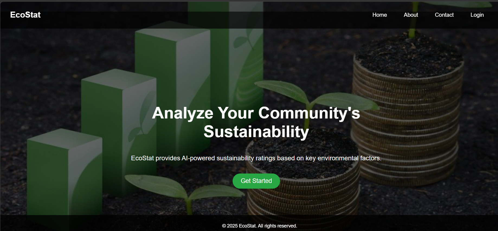
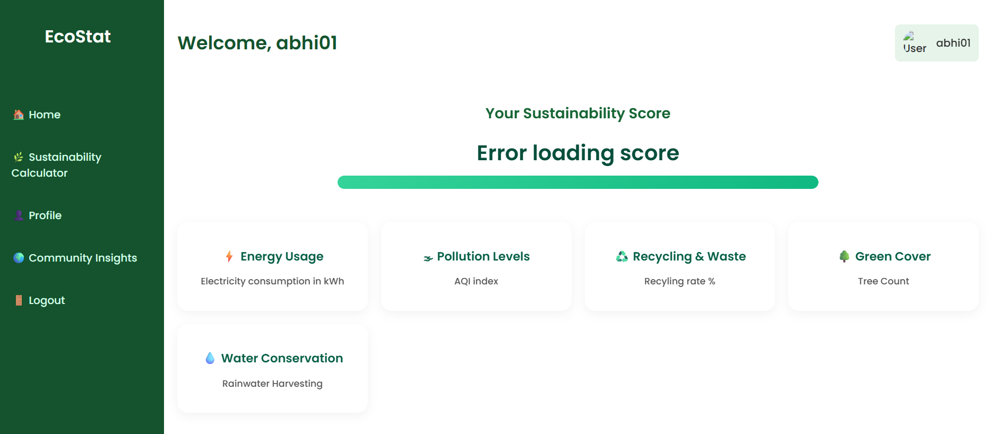
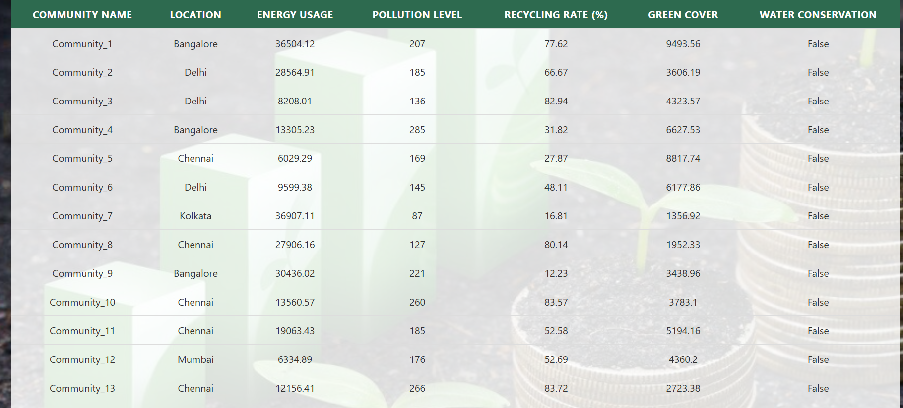

# EcoStat

EcoStat is a machine learning-powered sustainability rating web application that predicts environmental sustainability scores using pollution and sustainability metrics.

## Features

- Predicts sustainability scores using Machine Learning
- User-friendly web interface built with Django
- Environmental impact assessment
- Data-driven sustainability analysis
- Interactive prediction system

## Tech Stack

- Python
- Django
- Scikit-learn
- Pandas
- NumPy
- SQLite
- HTML
- CSS

## Project Structure

```text
EcoStat/
├── accounts/
├── ecostat/
├── static/
├── templates/
├── manage.py
├── requirements.txt
└── ecostat_sample_dataset.csv
```
## Screenshots

### Home Page


### Login Page


### Dashboard


### Sustainability Calculator


### Community Insights


## Future Improvements

- User authentication
- Advanced sustainability analytics
- Better visualization dashboards
- Real-time environmental data integration
- Cloud deployment enhancements
